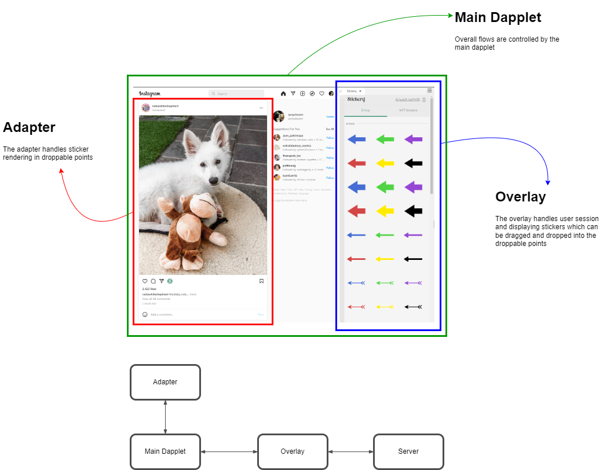
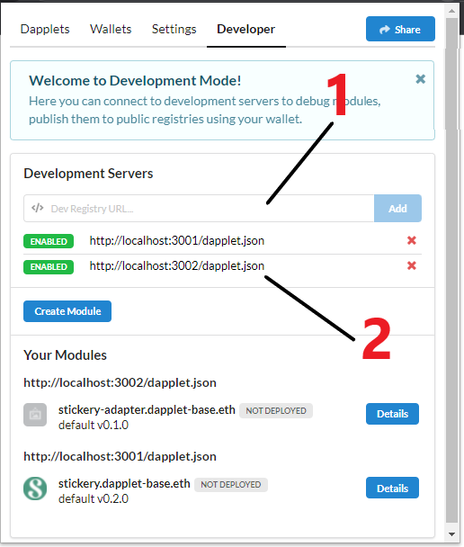
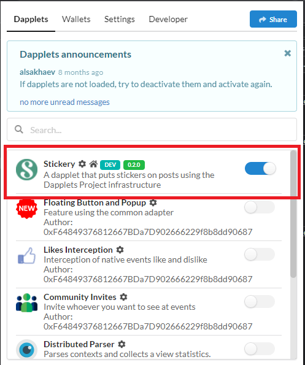

# Stickery

A dapplet that puts stickers on posts using the Dapplets Project infrastructure.

## Demo
- Stickery on Twitter: https://youtu.be/2kHhvelgrL0
- [](https://www.youtube.com/watch?v=2kHhvelgrL0)
- Stickery on Instagram: https://youtu.be/LejA7AtBa8E
- [](https://www.youtube.com/watch?v=LejA7AtBa8E)

## Project Structure
- `root folder` contains the main dapplet.
- `adapter` contains a dapplet code which handles twitter and instagram droppable points for stickers.
- `overlay` contains an overlay code which handles authentication, sticker selection, etc.
- `server` contains a server side code providing APIs

## Project Architecture
<div width="100%">
  
</div>

## Project Setup

This project requires NodeJS V14. First, after pulling the repo, we have to install all dependencies.
```shell
# 1. Install the main dapplet dependencies
$ npm ci

# 2. Install the server dependencies
$ (cd server; npm ci)

# 3. Install the over dependencies
$ (cd overlay; npm ci)

# 4. Install the adapter dependencies
$ (cd adapter; npm ci)
```

The next step we will setup environment variables
```shell
$ cat server/.env.example > server/.env
$ cat overlay/.env.example > overlay/.env
```

Since our server uses MySQL, in our development we can run a provided docker compose file to start DB and its admin UI.
```shell
$ docker-compose -f server/docker-compose.db.yaml up -d
```

Run migration scripts to create tables and insert seed data
```shell
$ cd server
$ npm run migrate:up
$ npm run db:fixtures
$ cd ..
```

Run all services together
```shell
# Assume that we are in the root project directory
$ npm run start
```

## Dapplet Setup

After setup was done, we will install dapplet extension. Please follow the steps in https://docs.dapplets.org/docs/installation

1. Open extension and add http://localhost:3001/dapplet.json and http://localhost:3002/dapplet.json as development servers in Developer tab. It should show two records at #2 in the picture below.
<div width="100%">
  
</div>

2. Go to Dapplets tab and enable stickery dapplet (before doing this step, we have to visit either www.twitter.com or www.instagram.com)
<div width="100%">
  
</div>

### **In case the dapplet is not running, please deactivate and re-activate it again.**

## Deployment
There are configs that have to be changed when deploying to production.
- In dapplet.json, edit the overlay url to where the overlay is deployed.
